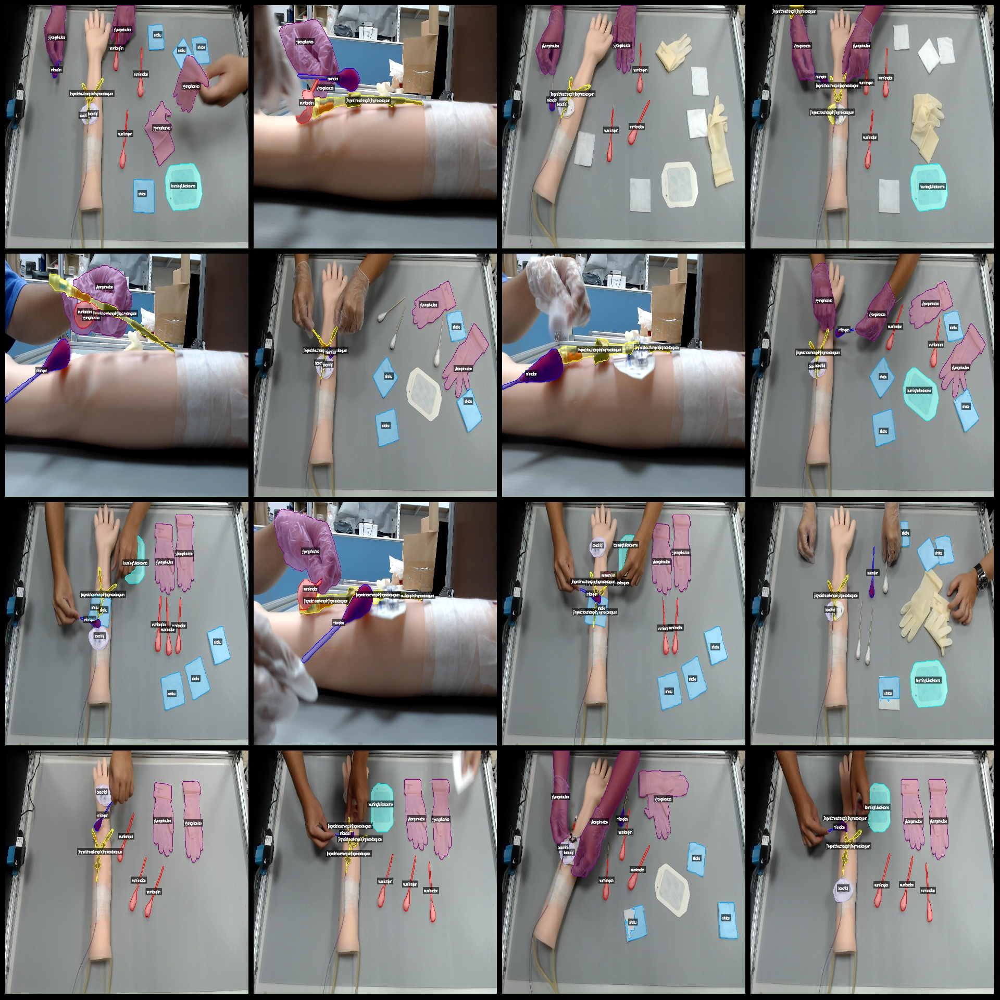
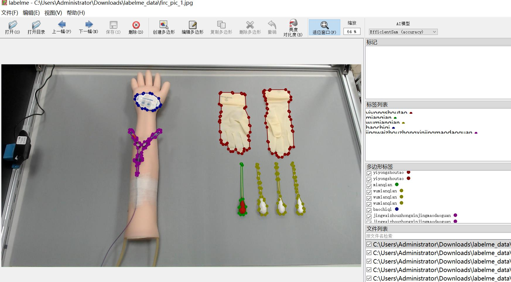

# Smart Medical Center Central Venous Catheter Procedure Equipment Identification and Segmentation Dataset (labelme format) - 2773 Category Images

Dataset format: labelme format (excluding mask files, only containing jpg images and corresponding json files)
Number of image files (jpg file count): 2773
Number of annotation files (json file count): 2773
Number of categories: 7
Annotation categories: ["baochiqi", "jingwaizhouzhongxinjingmaodaoguan", "mianqian", "shabu", "toumingfuliaobaomo", "wumianqian", "yiyongshoutao"]
["Oral retainer", "Peripherally-centered central venous catheter", "Sponge", "Gauze", "Transparent dressing film", "No sponge", "Medical glove"]
Number of boxes for each category:
- baochiqi count = 2685
- jingwaizhouzhongxinjingmaodaoguan count = 4067
- mianqian count = 2807
- shabu count = 5033
- toumingfuliaobaomo count = 1348
- wumianqian count = 5646
- yiyongshoutao count = 5447
Total box count: 27033
Annotation tool used: labelme v.5.5.0
Image resolution: 1920x1080
Annotation rules: Polygons are drawn around the categories
Important note: The dataset can be opened and edited with labelme; however, the json dataset requires conversion to either mask or yolo format for semantic segmentation or instance segmentation
Special declaration: This dataset does not guarantee any accuracy in the training of models or weight files
Image preview:
Annotation example:
Annotation drawing results:
Labelme editing image example:
## Images

Here is a pay link on Stripe ( https://buy.stripe.com/3cs8yP7sY87d0vu9AB ). Please contact me lonlonago@foxmail.com after funding $89, and I will send you a complete data files , thank you!

